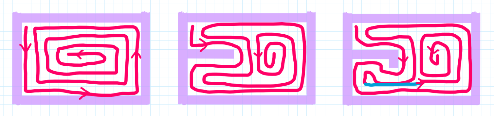
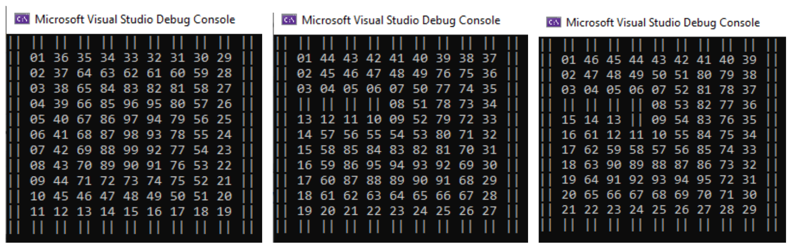
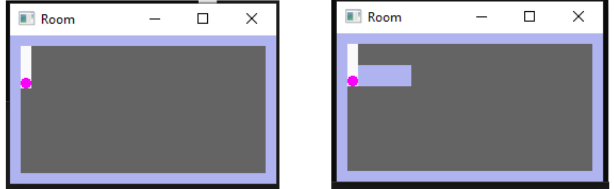
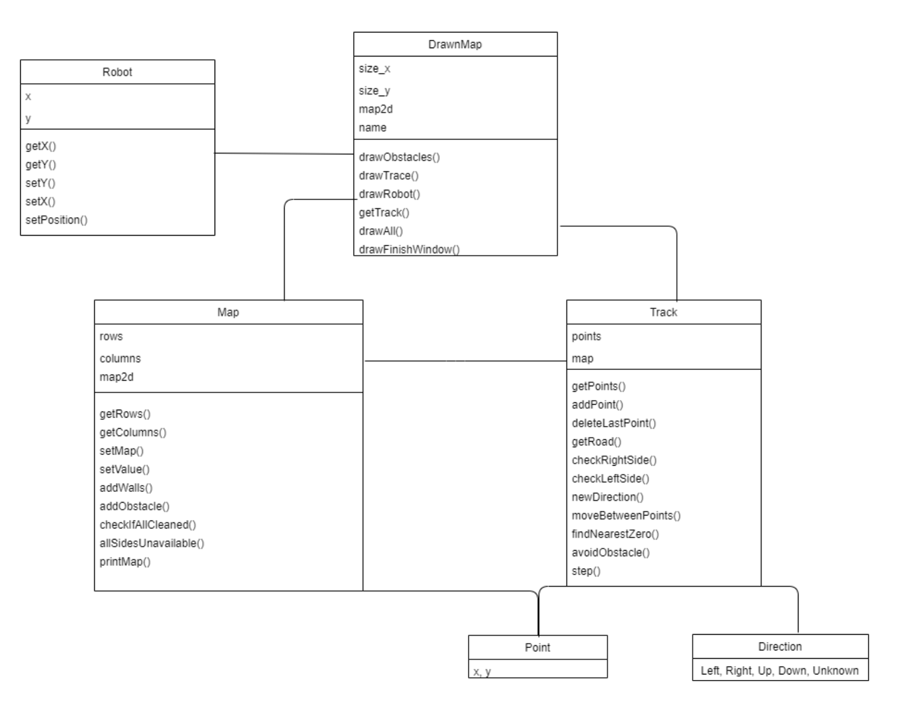

# Robot vacuum cleaner

The cleaning robot project was realized by implementing six classes that allow selecting room size, adding walls and obstacles, and then 'activating' the robot so that it can traverse the entire obstacle-free and wall-lined area. The robot moves in such a way that it always keeps a wall, obstacle, or already cleaned area on its right side. When it reaches a point where there is no more cleaning area adjacent to it but there is still some elsewhere on the map, it calculates the nearest distance to that location, moves to it, and then continues its standard operation.

## Project work flow
First, we deliberated on the robot's path, focusing on the driving algorithm:

  

Then, we opted for a terminal application:

  

In the screenshots, you can see obstacles marked as '||,' and the consecutive numbers represent the robot's positions.
The terminal version was quite challenging to comprehend, so we decided to go with a graphical version using SFML:

  

In the screenshots, obstacles and walls are marked in purple, the robot as a pink circle. Gray areas are still dirty surfaces, while white areas are already clean.

## Used tools
The graphical interface was created using the Simple and Fast Multimedia Library, which allows us to observe the robot's movement in real-time. A supportive aspect of the work involved the use of Test-Driven Development (TDD).

## Project architecture

  

1. Map Class – Contains methods that allow, among others: to add walls, add obstacles, check whether the entire map area has been cleaned up.
2. Track class – Its methods are used to implement the robot's movement algorithm. As mentioned earlier, the robot drives in such a way that it has an obstacle, wall or cleaned element on its right side, depending on what it encounters on its way, it adjusts its driving direction. This refers here to the Direction enumeration class in which driving directions are stored: Left , Right, Up, Down, Unknown. The first 4 directions are standard directions, while the Unknown direction determines how the robot should go when there are no places around it to clean. It then searches for the closest field with a value of 0 (uncleaned), determines a straight line connecting the two fields and moves along it, avoiding any obstacles it encounters.
3. DrawnMap class - It is an implementation of the robot's route and movement. An object of the DrawnMap class is created for an object of the Map class. Thanks to the use of the Simple and Fast Multimedia Library, we are able to show a map saved as a vector of 2D points on the screen as an image, and what is more, we are able to constantly track the robot's movement.
4. Robot class - Its methods allow us to set and retrieve the robot's position.
5. Point Class - Structure for storing coordinates.
6. Direction class - enumeration class for storing possible driving directions: Left, Right, Up, Down, Unknown.
